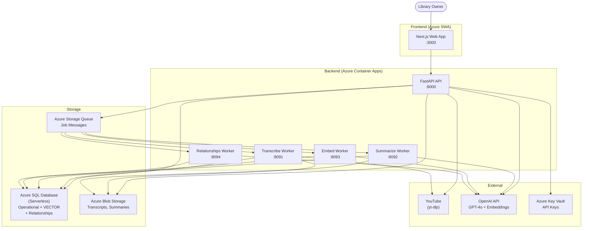
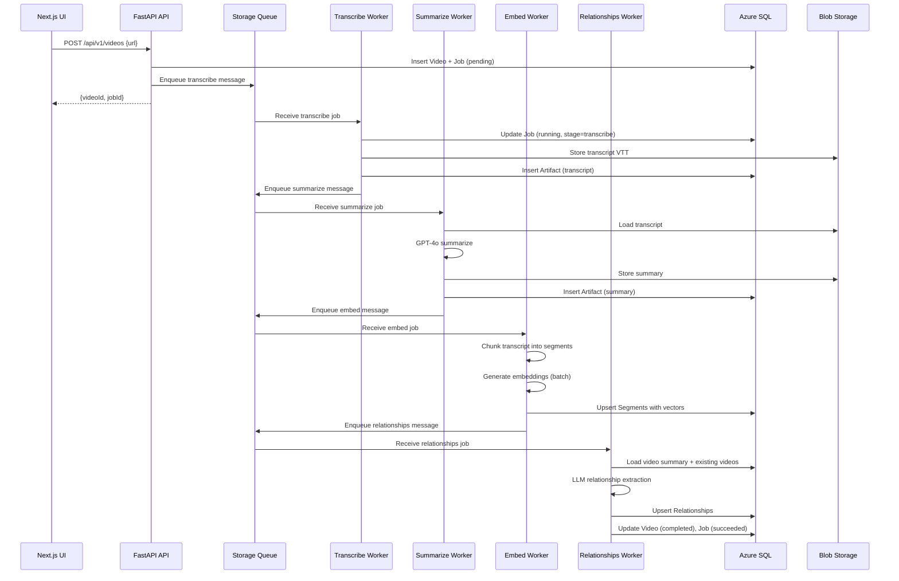
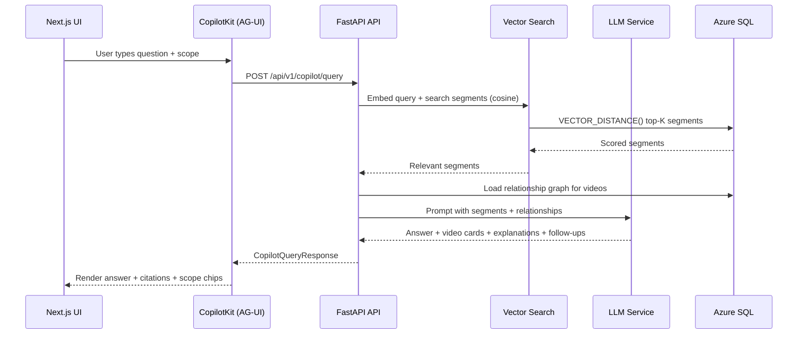
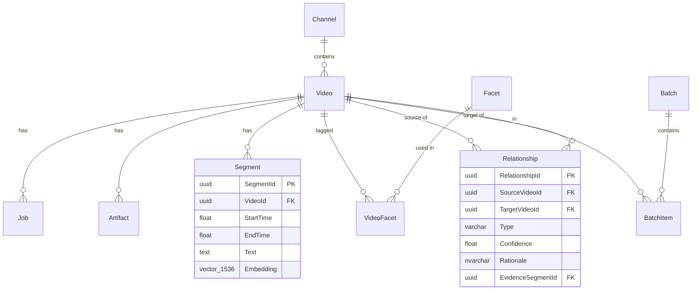

# Design: YT Summarizer Product Foundation

**Status**: Implementing
**Milestone**: M1
**Spec Phase**: execution
**Created**: 2025-12-13
**Updated**: 2026-04-04

---

## Architecture Overview

YT Summarizer is a **mono-repo web application** with a Next.js frontend, Python FastAPI backend,
Python background workers, and a shared Python package. Locally orchestrated via .NET Aspire;
deployed to Azure (SWA + ACA + SQL + Storage).

### Component Diagram

---

## Background Pipeline Data Flow

---

## Copilot Query Data Flow

---

## File Structure

| Path | Create/Modify | Purpose |
|------|--------------|---------|
| `apps/web/src/app/` | Exists | Next.js App Router pages |
| `apps/web/src/components/` | Exists | React components by domain |
| `apps/web/src/components/copilot/` | Exists | CopilotKit chat components |
| `apps/web/src/components/library/` | Exists | Browse/filter components |
| `apps/web/src/components/jobs/` | Exists | Job status/progress components |
| `apps/web/src/hooks/` | Exists | Custom React hooks |
| `apps/web/src/services/api.ts` | Exists | Fetch wrapper + type-safe API client |
| `services/api/src/api/routes/` | Exists | FastAPI route handlers |
| `services/api/src/api/services/` | Exists | Business logic layer |
| `services/api/src/api/models/` | Exists | Pydantic request/response models |
| `services/api/src/api/agents/` | Exists | AG-UI agent definitions |
| `services/workers/transcribe/` | Exists | Transcript acquisition worker |
| `services/workers/summarize/` | Exists | LLM summarisation worker |
| `services/workers/embed/` | Exists | Chunking + embedding worker |
| `services/workers/relationships/` | Exists | Relationship extraction worker |
| `services/shared/shared/db/` | Exists | SQLAlchemy models + connection |
| `services/shared/shared/queue/` | Exists | Storage Queue client |
| `services/shared/shared/blob/` | Exists | Blob Storage client |
| `services/shared/shared/telemetry/` | Exists | OpenTelemetry configuration |
| `services/aspire/AppHost/AppHost.cs` | Exists | Aspire composition root |
| `infra/` | Exists | Azure infrastructure (Terraform/Bicep) |

---

## Technical Decisions

| Decision | Options Considered | Choice | Rationale |
|----------|-------------------|--------|-----------|
| Vector storage | pgvector, Pinecone, Azure SQL VECTOR | Azure SQL VECTOR | Single database; no extra service; sufficient at hobby scale |
| Queue system | Service Bus, Hangfire, SQL polling, Storage Queue | Azure Storage Queue | Serverless, cheap, simple; visibility timeout = implicit locking |
| Chat UI | Custom, LangChain, CopilotKit | CopilotKit (AG-UI) | Production-ready chat components; scope chips; citation rendering |
| Transcript acquisition | YouTube Data API, audio+Whisper, yt-dlp | yt-dlp only | Better rate-limit handling; single library; VTT with timestamps |
| Graph storage | SQL Graph, Neo4j, JSON, explicit table | Explicit Relationships table | Simplest; standard SQL queries; 1-2 hop traversals sufficient |
| Observability | Custom logging only, Datadog, OpenTelemetry | OpenTelemetry + Aspire | First-class Aspire integration; no extra cost; distributed traces |
| Explanation delivery | Separate `/explain` endpoint, inline in query | Inline in query response | Eliminates redundant embedding calls; instant UI response |

---

## API Endpoints

| Method | Path | Purpose |
|--------|------|---------|
| POST | `/api/v1/videos` | Submit a video URL for ingestion |
| GET | `/api/v1/videos/{videoId}` | Get video details |
| POST | `/api/v1/videos/{videoId}/reprocess` | Re-queue a video for processing |
| GET | `/api/v1/jobs` | List jobs with filters |
| GET | `/api/v1/jobs/{jobId}` | Get job details |
| POST | `/api/v1/jobs/{jobId}/retry` | Retry a failed job |
| POST | `/api/v1/channels` | Fetch channel video list |
| POST | `/api/v1/batches` | Create a batch ingestion |
| GET | `/api/v1/batches` | List batches |
| GET | `/api/v1/batches/{batchId}` | Get batch detail with items |
| POST | `/api/v1/batches/{batchId}/retry` | Retry all failed in batch |
| GET | `/api/v1/library/videos` | Browse library with filters |
| GET | `/api/v1/library/channels` | List channels |
| GET | `/api/v1/library/facets` | Get facets/tags |
| GET | `/api/v1/library/videos/{videoId}/segments` | Get segments for a video |
| POST | `/api/v1/copilot/query` | Copilot query with scope |
| POST | `/api/v1/copilot/search/segments` | Semantic segment search |
| POST | `/api/v1/copilot/search/videos` | Semantic video search |
| POST | `/api/v1/copilot/topics` | Topics in scope |
| POST | `/api/v1/copilot/coverage` | Library coverage metrics |
| GET | `/api/v1/copilot/neighbors/{videoId}` | Related videos |
| POST | `/api/v1/copilot/synthesize` | Synthesize learning path / watch list |
| GET | `/health` | Health check with uptime |

---

## Data Model Summary

---

## Error Handling Strategy

| Error Type | Handling |
|-----------|---------|
| YouTube rate limit | Detect 429 response; retry with exponential backoff |
| Invalid transcript content | Content validation before storing; treat as transient failure |
| OpenAI API error | Retry with backoff; dead-letter after max retries |
| DB cold start (serverless) | Health endpoint reports degraded; UI shows "Warming up..." banner |
| Worker crash | Message becomes visible in queue again (visibility timeout); automatic retry |
| Duplicate URL | Detect on submission; offer skip or reprocess |
| Empty scope | Explain to user and suggest broadening |

---

## Test Strategy

| Level | Tooling | Scope |
|-------|---------|-------|
| Unit (Python) | pytest | Services, workers, models, utilities |
| Integration | pytest | Database operations, queue client, blob client |
| Unit (TypeScript) | Vitest | React components, hooks, utilities |
| E2E | Playwright | Full user flows (ingest, browse, copilot, explain, synthesis) |

---

## Security

- **Network boundary trust** — no per-request API authentication between internal services
- **Managed Identity** — API and workers use Azure Managed Identity to access SQL, Blob, Queue
- **Key Vault** — OpenAI API key stored in Key Vault, accessed via Managed Identity
- **No secrets in repo** — all secrets via Aspire user-secrets or Key Vault references
- **Correlation ID** — every request traceable end-to-end without exposing internal IDs
