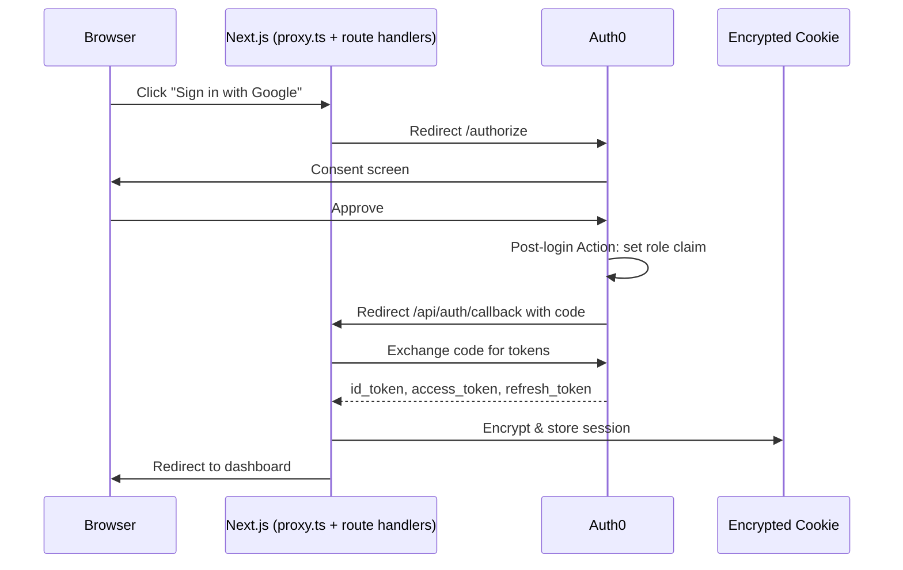
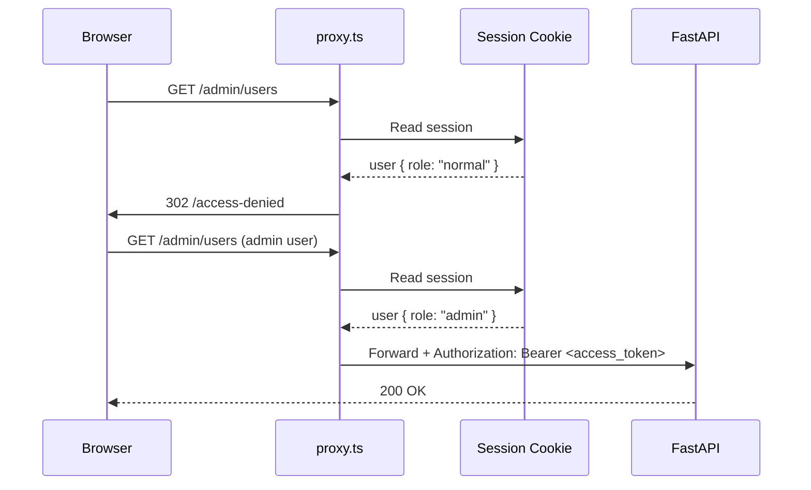

# Design: Auth0 BFF Authentication + RBAC

**Feature ID**: F004  
**Agent**: Dallas (Architecture)  
**Status**: Implementing

---

## Overview

Use `@auth0/nextjs-auth0` in BFF mode: the Next.js server handles all token exchange and session management via encrypted HTTP-only cookies; the browser never sees raw tokens. Route protection lives in `proxy.ts` (Next.js 16 middleware). Roles are stored in Auth0 `app_metadata` and injected into tokens by a post-login Action as a namespaced custom claim. All infrastructure — connections, users, Actions — is Terraform-managed.

---

## Architecture

```mermaid
graph TD
    Browser -->|Click Sign In| LoginPage[apps/web/src/app/login/page.tsx]
    LoginPage -->|/api/auth/login| RouteHandler[app/api/auth/auth0/route.ts]
    RouteHandler -->|OAuth redirect| Auth0[Auth0 Tenant]
    Auth0 -->|Post-login Action| RoleAction[Add role claim to tokens]
    Auth0 -->|/api/auth/callback| RouteHandler
    RouteHandler -->|Set encrypted cookie| Browser
    Browser -->|GET /admin| ProxyMiddleware[proxy.ts]
    ProxyMiddleware -->|Read session cookie| Auth0SDK[@auth0/nextjs-auth0]
    Auth0SDK -->|User + role| ProxyMiddleware
    ProxyMiddleware -->|role != admin| AccessDenied[/access-denied]
    ProxyMiddleware -->|role == admin + Bearer token| API[FastAPI Backend]
```

### Component Responsibilities

| Component | Responsibility |
|-----------|---------------|
| `proxy.ts` | Route protection middleware — reads session, checks role, forwards or redirects |
| `AuthContext.tsx` | React context — exposes `user`, `isLoading`, `error`, `isAuthenticated`, `hasRole` |
| `useAuth()` hook | Single public interface for components to access auth state |
| `lib/auth0.ts` | Auth0Client initialization (one instance, server-side) |
| `lib/auth-utils.ts` | Pure utility functions: `hasRole`, `getAuthMethod`, `getProvider` |
| `types/auth.ts` | Error types: `AuthError`, `SessionExpiredError`, `UnauthorizedError`, `OAuthError` |
| `app/api/auth/[auth0]/route.ts` | Built-in Auth0 route handlers (login, logout, callback, profile) |
| `components/auth/` | UI components: `LoginButton`, `LogoutButton`, `UserProfile`, `UsernamePasswordForm`, `AuthLoading` |
| Terraform `modules/auth0/` | Connections, users, Actions, trigger bindings |
| Terraform `environments/prod/auth0.tf` | Test account provisioning + Key Vault secrets |

---

## Data Flow

### OAuth Login Flow



### Role-Based Access Check



---

## Technical Decisions

| Decision | Options Considered | Choice | Rationale |
|----------|-------------------|--------|-----------|
| Session storage | JWT in localStorage, server DB, encrypted cookie | Encrypted httpOnly cookie | Secure by default, SDK manages rotation |
| RBAC approach | Native Auth0 RBAC, DB roles, `app_metadata` | `app_metadata` + custom claim | Free tier compatible, sufficient for 2 roles |
| Middleware location | `middleware.ts`, `proxy.ts`, per-page HOC | `proxy.ts` (Next.js 16) | New Next.js 16 convention, centralised |
| E2E auth method | ROPG, UI login + storage state, mock | UI login + storage state | ROPG violates FR-019; mock doesn't test real flow |
| Public API surface | Direct SDK imports, HOC, context hook | `useAuth()` hook | Single entry point, mockable, no circular deps |
| Role storage format | JWT claim only, DB, `app_metadata` | `app_metadata` + Action injection | Persistent, server-authoritative, Free tier |

---

## File Structure

| File | Action | Owner |
|------|--------|-------|
| `apps/web/src/lib/auth0.ts` | Create | Lambert |
| `apps/web/src/proxy.ts` | Create | Lambert |
| `apps/web/src/app/api/auth/[auth0]/route.ts` | Create | Lambert |
| `apps/web/src/contexts/AuthContext.tsx` | Create | Lambert |
| `apps/web/src/hooks/useAuth.ts` | Create | Lambert |
| `apps/web/src/lib/auth-utils.ts` | Create | Lambert |
| `apps/web/src/types/auth.ts` | Create | Lambert |
| `apps/web/src/components/auth/LoginButton.tsx` | Create | Lambert |
| `apps/web/src/components/auth/LogoutButton.tsx` | Create | Lambert |
| `apps/web/src/components/auth/UserProfile.tsx` | Create | Lambert |
| `apps/web/src/components/auth/UsernamePasswordForm.tsx` | Create | Lambert |
| `apps/web/src/components/auth/AuthLoading.tsx` | Create | Lambert |
| `apps/web/src/components/auth/README.md` | Create | Lambert |
| `apps/web/src/components/Navbar.tsx` | Modify | Lambert |
| `apps/web/src/components/ErrorBoundary.tsx` | Create | Lambert |
| `apps/web/src/lib/logger.ts` | Create/Modify | Lambert |
| `apps/web/src/lib/api-client.ts` | Create | Lambert |
| `apps/web/src/app/login/page.tsx` | Create | Lambert |
| `apps/web/src/app/admin/page.tsx` | Create | Lambert |
| `apps/web/src/app/access-denied/page.tsx` | Create | Lambert |
| `apps/web/src/app/layout.tsx` | Modify | Lambert |
| `apps/web/src/__tests__/` (auth unit tests) | Create | Kane |
| `apps/web/e2e/` (auth E2E tests) | Create | Kane |
| `apps/web/playwright/auth.setup.ts` | Create | Kane |
| `apps/web/playwright.config.ts` | Modify | Kane |
| `apps/web/playwright/.auth/admin.json` | Create | Kane |
| `apps/web/playwright/.auth/user.json` | Create | Kane |
| `infra/terraform/modules/auth0/main.tf` | Modify | Parker |
| `infra/terraform/environments/prod/variables.tf` | Modify | Parker |
| `infra/terraform/environments/prod/auth0.tf` | Create | Parker |
| `services/api/tests/test_auth_integration.py` | Create | Ripley |
| `.github/workflows/` (Key Vault step) | Modify | Parker |

---

## Interfaces

```typescript
// Public auth interface — all consumers use useAuth(), never Auth0 SDK directly
interface AuthContextValue {
  user: User | null;
  isLoading: boolean;
  error: AuthError | null;
  isAuthenticated: boolean;
  hasRole: (role: Role) => boolean;
}

// User shape (from Auth0 token)
interface User {
  sub: string;                           // "google-oauth2|123" or "auth0|abc"
  email: string;
  email_verified: boolean;
  name?: string;
  picture?: string;
  username?: string;
  'https://yt-summarizer.com/role': Role;
  updated_at: string;
}

type Role = 'admin' | 'normal';

// Session (managed by SDK in encrypted cookie)
interface Session {
  user: User;
  accessToken: string;
  refreshToken?: string;
  idToken: string;
  tokenType: 'Bearer';
  expiresAt: number;
}

// Error hierarchy
class AuthError extends Error { code: string; statusCode: number; }
class SessionExpiredError extends AuthError {}   // FR-015a
class UnauthorizedError extends AuthError {}     // FR-007
class OAuthError extends AuthError {}            // FR-015b
```

---

## Error Handling

| Scenario | Strategy | User Impact |
|----------|----------|-------------|
| Session expired during active use | Redirect to `/login?returnTo=<url>` + "Session expired" message | Preserves destination for post-login redirect |
| OAuth denial / provider error | Inline error on login page, retry button, alternate provider option | No partial auth state created |
| Unauthorized route access | 302 redirect to `/access-denied` | Clear explanation, no 403 raw response |
| Missing/invalid JWT on API | 401 → `api-client.ts` triggers session refresh or redirect | User re-authenticated transparently |
| Key Vault unavailable during test | CI pipeline fails immediately with descriptive error | No false test results |
| Auth0 rate limit during tests | Storage-state reuse means ≤ 1 token call per worker; backoff retry | Bounded, not silent failure |

---

## Security Considerations

1. **No secrets in repo** — all credentials via Azure Key Vault (FR-019, V.1)
2. **Token in httpOnly cookie** — inaccessible to JavaScript (XSS protection)
3. **Role stored in `app_metadata`** — not user-editable; set server-side by Terraform/Management API
4. **Custom claim namespaced** — `https://yt-summarizer.com/role` prevents collision
5. **Refresh token rotation** — old token invalidated after use
6. **Test account isolation** — internal email domain, Key Vault access scoped to CI service principal
7. **CORS** — `proxy.ts` forwards cookies; API must have SameSite-compatible CORS policy (Ripley)
8. **Audit logging** — auth events logged with correlation IDs (FR-035, SC-023)

---

## Performance Considerations

- **Rolling sessions** (24 h) reduce token refresh frequency
- **Storage-state reuse** in Playwright — 1 auth call per worker vs 1 per test
- **Auth module is a leaf** — no circular imports; tree-shaking friendly
- **Server components** can call `getSession()` directly; no client-side waterfall

---

## Test Strategy

### Unit Tests (Vitest + Testing Library)
- `useAuth` hook with mocked `@auth0/nextjs-auth0`
- `hasRole`, `getAuthMethod`, `getProvider` pure functions (no mocks needed)
- `LoginButton`, `UserProfile`, `LogoutButton`, `UsernamePasswordForm` components
- `proxy.ts` middleware logic (role check, redirect behaviour)
- `api-client.ts` token forwarding + 401 handler

### Integration Tests (pytest)
- API token validation with test JWT
- Existing API tests updated to include `Authorization: Bearer` header

### E2E Tests (Playwright)
- Social login flow (Google OAuth)
- Session persistence across page refresh
- Sign-out flow
- Admin user accesses `/admin`
- Normal user denied `/admin`
- Role-based navigation menu
- Username/password login flow
- Dual login method UI
- Unauthenticated redirect to login
- Authenticated user on protected page

---

## Existing Patterns to Follow

- Terraform module pattern from `infra/terraform/modules/` (see `modules/auth0/main.tf`)
- Key Vault secret storage pattern from existing `azurerm_key_vault_secret` resources
- GitHub Actions OIDC authentication already configured — reuse for Key Vault step
- Playwright config project pattern already established in `apps/web/playwright.config.ts`
- FastAPI dependency injection for token validation already in `services/api/`
