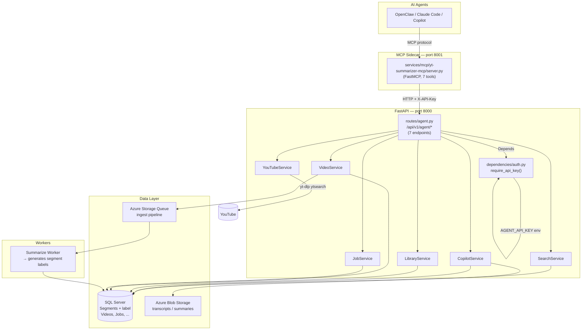
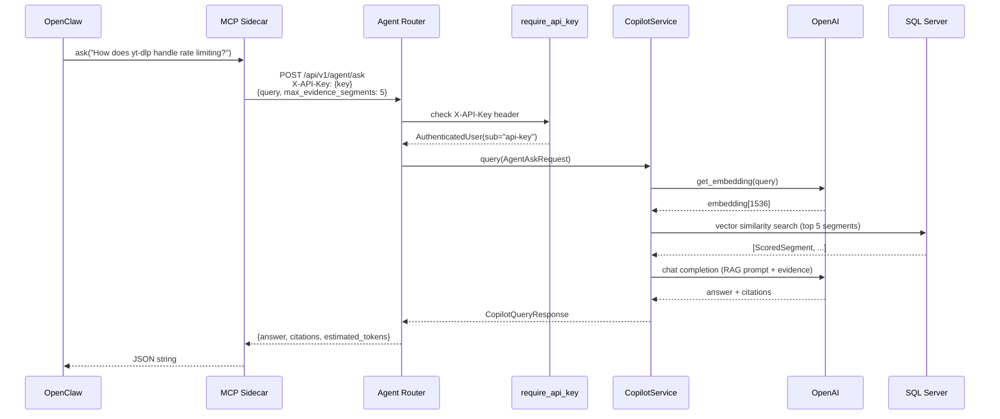
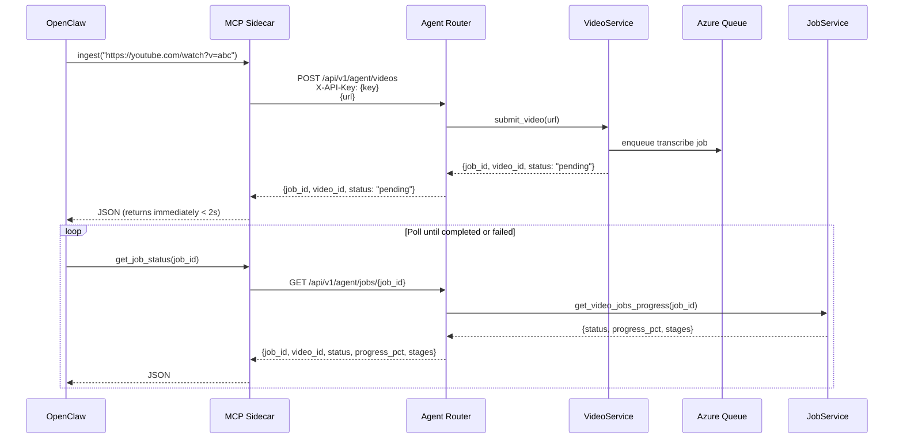

# Design: OpenClaw Integration

**Status**: Draft
**Milestone**: M6
**Spec Phase**: design
**Created**: 2026-04-06
**Updated**: 2026-04-06

---

## Files Read & Patterns Observed

| File | Key Observation |
|------|----------------|
| `goals.md` / `research.md` / `requirements.md` | Architecture, 7 tools, API contracts, sidecar pattern confirmed |
| `services/mcp/yt-summarizer-mcp/server.py` | Uses `FastMCP`, `httpx`, already reads `YT_SUMMARIZER_API_KEY` → `X-API-Key` header |
| `services/api/src/api/routes/library.py` | Route pattern: `APIRouter(prefix=..., tags=[...])`, `Depends(get_session)`, service factories, `HTTPException` for 404 |
| `services/api/src/api/routes/copilot.py` | Auth via `Depends(require_auth)` or `Depends(check_copilot_quota)`, error → `HTTPException` |
| `services/api/src/api/dependencies/auth.py` | `require_auth` already supports `X-API-Key` via `_check_api_key()`; reads `API_KEY` env var |
| `services/api/src/api/models/base.py` | `BaseResponse(ConfigDict(from_attributes=True, populate_by_name=True))`, global error handlers return `{"error": {"code", "message"}}` |
| `services/api/src/api/models/library.py` / `copilot.py` | Pydantic v2, `Field(description=...)`, snake_case fields, aliases for camelCase UI models |
| `services/api/src/api/main.py` | Global exception handlers produce `{"error": {"code", "message", "correlation_id"}}` — agent routes inherit this automatically |
| `services/api/src/api/services/youtube_service.py` | `YouTubeService` with proxy support, `fetch_channel_videos()` pattern; no `search_videos()` yet |
| `services/workers/summarize/worker.py` | Step order: fetch → generate → store → `_create_artifact` → mark complete → queue next. Label generation goes after `_create_artifact`. OpenAI client already available. Mock mode when no API key. |
| `services/shared/alembic/versions/014_*.py` | Naming: `NNN_description.py`, `revision="014"`, `down_revision="013"`. Next: `015`. Uses `op.execute()` for SQL Server DDL. |
| `services/shared/shared/db/models/segment.py` | `Mapped[str \| None] = mapped_column(String(N), nullable=True)` pattern |

---

## 1. Component Diagram



---

## 2. File Structure Table

| File | Action | Purpose |
|------|--------|---------|
| `services/api/src/api/routes/agent.py` | **Create** | All 7 `/api/v1/agent/` endpoints (search, youtube search, get_video, segments, ask, ingest, job status) |
| `services/api/src/api/models/agent.py` | **Create** | Pydantic request/response models for agent API — flat, LLM-optimised shapes |
| `services/api/src/api/dependencies/auth.py` | **Modify** | Add `require_api_key` dependency (API-key-only, no session fallback) |
| `services/api/src/api/main.py` | **Modify** | Import and register `agent` router |
| `services/api/src/api/services/youtube_service.py` | **Modify** | Add `search_videos(query, limit)` method using yt-dlp `ytsearch{n}:` prefix |
| `services/mcp/yt-summarizer-mcp/server.py` | **Modify** | Replace 7 existing tools with the 7 MVP tools wired to `/api/v1/agent/` routes |
| `services/shared/alembic/versions/015_add_segment_label.py` | **Create** | Add `Segments.label NVARCHAR(200) NULL` column |
| `services/shared/shared/db/models/segment.py` | **Modify** | Add `label: Mapped[str \| None] = mapped_column(String(200), nullable=True)` |
| `services/workers/summarize/worker.py` | **Modify** | Add `_generate_segment_labels(video_id)` step after `_create_artifact()` |
| `services/api/tests/test_agent.py` | **Create** | Unit + integration tests for all 7 agent routes |
| `services/mcp/yt-summarizer-mcp/tests/test_mcp_tools.py` | **Create** | Tests verifying each MCP tool calls the correct agent endpoint |

**Total: 7 modified, 4 created = 11 files**

---

## 3. Data Flow — Sequence Diagrams

### Flow A: `ask(question)` — RAG query



### Flow B: `ingest(url)` — async ingestion with polling



---

## 4. Technical Decisions Table

| Decision | Options Considered | Choice | Rationale |
|----------|--------------------|--------|-----------|
| API key env var name | `API_KEY` (existing), `AGENT_API_KEY` (new) | **`AGENT_API_KEY`** | Clean separation from UI auth key; existing `API_KEY` is for `require_auth` (UI + agent); `AGENT_API_KEY` signals agent-only scope and avoids confusion |
| Auth dependency | Reuse `require_auth`, new `require_api_key`, router-level middleware | **New `require_api_key` in `dependencies/auth.py`** | Agent routes must NEVER accept session cookie; dedicated dep makes this explicit and testable |
| Route file location | New `agent.py`, extend `copilot.py`, extend `library.py` | **New `routes/agent.py`** | Clean separation, no coupling to UI/copilot routes; mirrors library.py pattern |
| `search_youtube` implementation | YouTube Data API v3, yt-dlp `ytsearch:`, Invidious API | **yt-dlp `ytsearch{n}:`** | Constitution hard rule; already in project; proxy-aware via existing WebShare wiring |
| `search_library` semantic search | New service method, reuse `SearchService.search_segments` | **Reuse `SearchService.search_segments` + reshape** | Full vector + text fallback already implemented; avoids duplication |
| `ask` implementation | New RAG pipeline, reuse `CopilotService.query` | **Reuse `CopilotService.query` + flatten** | Production RAG already works; just reshape `CopilotQueryResponse` to flat LLM JSON |
| `get_video` segments_index source | Separate DB query, extend `LibraryService.get_video_detail` | **Separate DB query in agent route** | Avoids modifying stable library service; keeps agent route self-contained |
| Label generation placement | Summarize worker, embed worker, separate post-processor | **Summarize worker after `_create_artifact()`** | Already has OpenAI client; embed worker uses embeddings client, not chat; single responsibility per stage |
| `estimated_tokens` calculation | tiktoken, `len(text) // 4`, word count × 1.3 | **`len(text) // 4`** | No tiktoken in API deps; sufficient for context-window guidance (±20% target); avoids new dependency |
| MCP architecture | In-process (same FastAPI port), sidecar (separate port) | **Sidecar (existing pattern)** | Already implemented and working; goals.md said "same process" but sidecar is cleaner and simpler |
| `ingest` job_id return shape | Return `video_id` as job proxy, return separate `job_id` | **Return both `job_id` and `video_id`** | `get_job_status` needs `job_id`; agent may also want `video_id` to query the video post-completion |

---

## 5. Auth Design

### `require_api_key` Dependency

**Location**: `services/api/src/api/dependencies/auth.py` (add alongside existing `require_auth`)

```python
async def require_api_key(request: Request) -> AuthenticatedUser:
    """FastAPI dependency for agent routes: API key only, no session fallback.

    Reads X-API-Key header and validates against AGENT_API_KEY env var.
    Returns 401 with consistent error body on missing or invalid key.
    """
    api_key = request.headers.get("X-API-Key")
    if not api_key:
        raise HTTPException(
            status_code=status.HTTP_401_UNAUTHORIZED,
            detail="API key required. Provide X-API-Key header.",
        )

    expected = os.environ.get("AGENT_API_KEY")
    if not expected:
        raise HTTPException(
            status_code=status.HTTP_503_SERVICE_UNAVAILABLE,
            detail="Agent API not configured.",
        )

    if api_key != expected:
        raise HTTPException(
            status_code=status.HTTP_401_UNAUTHORIZED,
            detail="Invalid API key.",
        )

    return AuthenticatedUser(
        sub="agent-api-key",
        email="agent@internal",
        name="Agent",
        picture=None,
        raw={"sub": "agent-api-key"},
    )
```

**Key properties:**
- **No session cookie fallback** — agent routes must never accept browser sessions
- **`AGENT_API_KEY` env var** — separate from the UI `API_KEY`; set in Aspire user-secrets as `Parameters:agent-api-key`
- **Applied at router level** — in `agent.py`: `router = APIRouter(prefix="/api/v1/agent", tags=["Agent"], dependencies=[Depends(require_api_key)])`, so ALL agent routes are protected without per-route decoration
- **MCP server forwards key** — `server.py` reads `YT_SUMMARIZER_API_KEY` env var and sends as `X-API-Key` header (already implemented in `_headers()`)
- **Error shape** — the global `http_exception_handler` in `main.py` transforms `HTTPException` to `{"error": {"code", "message", "correlation_id"}}` automatically

---

## 6. Segment Label Design

### Alembic Migration — `015_add_segment_label.py`

```python
"""Add label column to Segments table.

Revision ID: 015
Revises: 014
Create Date: 2026-04-06
"""

from alembic import op

revision = "015"
down_revision = "014"
branch_labels = None
depends_on = None


def upgrade() -> None:
    op.execute("ALTER TABLE Segments ADD label NVARCHAR(200) NULL")


def downgrade() -> None:
    op.execute("ALTER TABLE Segments DROP COLUMN label")
```

### SQLAlchemy Model Update

In `services/shared/shared/db/models/segment.py`, add after `model_name`:

```python
label: Mapped[str | None] = mapped_column(String(200), nullable=True)
```

No index — labels are only read, never filtered on.

### Label Generation in Summarize Worker

**Placement**: After `await self._create_artifact(...)` succeeds, before `await mark_job_completed(...)`.

**New method**:
```python
async def _generate_segment_labels(self, video_id: str) -> None:
    """Generate 5-10 word labels for each segment after summarization."""
    settings = get_settings()
    has_valid_config = settings.openai.is_azure_configured or (
        settings.openai.api_key and settings.openai.api_key != "not-configured"
    )
    if not has_valid_config:
        logger.info("Skipping segment label generation — no OpenAI config")
        return

    db = get_db()
    async with db.session() as session:
        from uuid import UUID
        from sqlalchemy import select
        from shared.db.models import Segment

        result = await session.execute(
            select(Segment).where(Segment.video_id == UUID(video_id))
        )
        segments = result.scalars().all()

    # Build OpenAI client (same logic as _generate_summary)
    client, model = self._build_openai_client(settings)

    for segment in segments:
        try:
            response = await client.chat.completions.create(
                model=model,
                messages=[
                    {"role": "system", "content": "You generate short, descriptive labels."},
                    {"role": "user", "content": f"Summarize this transcript excerpt in 5-10 words:\n\n{segment.text}"},
                ],
                max_tokens=30,
                temperature=0.3,
            )
            label = response.choices[0].message.content.strip()
            # Strip trailing punctuation and truncate to 200 chars
            label = label.rstrip(".!?")[:200]

            db = get_db()
            async with db.session() as session:
                from sqlalchemy import update
                from shared.db.models import Segment as SegmentModel
                await session.execute(
                    update(SegmentModel)
                    .where(SegmentModel.segment_id == segment.segment_id)
                    .values(label=label)
                )
        except Exception as e:
            logger.warning("Failed to generate label for segment", segment_id=str(segment.segment_id), error=str(e))
            # Continue with remaining segments — partial label generation is acceptable
```

**Prompt**: `"Summarize this transcript excerpt in 5-10 words: {text}"`  
**Model**: same as summary (gpt-4o-mini / Azure deployment)  
**Cost**: ~$0.0002 per video — negligible  
**Mock mode**: skipped entirely when no OpenAI config — no mock labels  
**NULL handling**: `get_video` returns `"label": null` for historical segments — agents treat null as "label not yet generated"  
**Backfill**: forward-only for MVP; a one-off script can backfill post-MVP (~$0.34 total)

---

## 7. Token Estimation Design

```python
def estimate_tokens(text: str) -> int:
    """Estimate token count using character heuristic (no tiktoken dependency).
    
    Approximation: ~4 characters per token (cl100k_base average).
    Accuracy target: within ±20% of actual tokeniser count.
    """
    return len(text) // 4
```

**Applied to**:
- `search_library` → `estimated_tokens = estimate_tokens(" ".join(r.snippet for r in results))`
- `get_video` → `estimated_tokens = estimate_tokens(full_transcript_text)` — fetched from blob storage or approximated from segment count × average segment length
- `get_segments` → `estimated_tokens = estimate_tokens(" ".join(s.text for s in segments))`
- `ask` → `estimated_tokens = estimate_tokens(answer + " ".join(c.snippet for c in citations))`

**Note**: `get_video` does NOT load the full transcript into the response; `estimated_tokens` is computed from transcript length stored in the `Artifact.content_length` field (chars). Formula: `artifact.content_length // 4`.

---

## 8. Error Handling Table

All errors are transformed by the global `http_exception_handler` in `main.py` into:
```json
{ "error": { "code": <int>, "message": "<str>", "correlation_id": "<str>" } }
```

Agent routes raise `HTTPException` with the appropriate status; the global handler formats it consistently.

| Scenario | HTTP Status | `error.code` | `error.message` |
|----------|-------------|--------------|-----------------|
| Missing `X-API-Key` header | 401 | 401 | `"API key required. Provide X-API-Key header."` |
| Invalid API key | 401 | 401 | `"Invalid API key."` |
| `AGENT_API_KEY` not configured | 503 | 503 | `"Agent API not configured."` |
| Video not found (`get_video`, `get_segments`) | 404 | 404 | `"Video {id} not found"` |
| Job not found (`get_job_status`) | 404 | 404 | `"Job {id} not found"` |
| yt-dlp search failure | 502 | 502 | `"YouTube search unavailable: {reason}"` |
| Invalid `start_sec`/`end_sec` range | 422 | 422 | (FastAPI validation — handled by `validation_exception_handler`) |
| `ask` query fails / LLM error | 500 | 500 | `"Query failed: {reason}"` |
| `ingest` — invalid YouTube URL | 400 | 400 | `"Invalid YouTube URL"` |
| `ingest` — duplicate video | 409 | 409 | `"Video already ingested: {youtube_video_id}"` |
| DB connection / timeout | 503 | 503 | `"Database is warming up, please retry in a few seconds"` |

---

## 9. MCP Tool Rewiring Plan

### Tools Being Replaced (old → new)

| Old Tool | Old Endpoint | New Tool | New Endpoint |
|----------|-------------|----------|-------------|
| `submit_video` | `POST /api/v1/videos` | `ingest` | `POST /api/v1/agent/videos` |
| `get_video` | `GET /api/v1/videos/{id}` | `get_video` | `GET /api/v1/agent/videos/{id}` |
| `get_video_progress` | `GET /api/v1/jobs/video/{id}/progress` | `get_job_status` | `GET /api/v1/agent/jobs/{job_id}` |
| `search_library` | `GET /api/v1/library/videos?search=` | `search_library` | `POST /api/v1/agent/search/semantic` |
| `get_library_stats` | `GET /api/v1/library/stats` | _(removed — not in 7-tool MVP)_ | — |
| `get_transcript` | `GET /api/v1/videos/{id}/transcript` | `get_segments` | `GET /api/v1/agent/videos/{id}/segments` |
| `get_summary` | `GET /api/v1/videos/{id}/summary` | _(absorbed into `get_video` response)_ | — |

### New Tools (not previously in MCP server)

| New Tool | Wraps |
|----------|-------|
| `search_youtube` | `GET /api/v1/agent/youtube/search?q=...&limit=N` |
| `ask` | `POST /api/v1/agent/ask` |

### MCP Server Changes Summary

1. Remove 7 existing tool functions
2. Add 7 new tool functions matching the MVP tool set
3. Update `_client()` timeout: default 30s; `ask` calls use 60s (`timeout=60.0`)
4. All tools follow the same pattern: call agent endpoint → `resp.raise_for_status()` → `json.dumps(resp.json(), indent=2)`
5. `get_segments` uses query params `start_sec` / `end_sec` (both optional)
6. `search_library` uses `POST` (body `{query, limit}`)
7. `ask` uses `POST` (body `{query, max_evidence_segments?}`)

### Updated MCP `_client` for `ask`

```python
def _ask_client() -> httpx.AsyncClient:
    """HTTP client with extended timeout for RAG ask calls."""
    return httpx.AsyncClient(base_url=API_URL, headers=_headers(), timeout=60.0)
```

---

## 10. Test Strategy

### Unit Tests — `services/api/tests/test_agent.py`

```python
# Mark: @pytest.mark.unit
# Mock: SearchService, CopilotService, LibraryService, VideoService, JobService, YouTubeService
# Use TestClient from starlette.testclient or AsyncClient from httpx
```

Tests per route:
- `POST /api/v1/agent/search/semantic` — happy path, missing query, limit validation, 401 without key
- `GET /api/v1/agent/youtube/search` — happy path, yt-dlp failure (502), missing `q` param
- `GET /api/v1/agent/videos/{id}` — happy path with labels, labels=null (old segments), 404
- `GET /api/v1/agent/videos/{id}/segments` — full range, time range filter, 404
- `POST /api/v1/agent/ask` — happy path, max_evidence_segments cap, LLM failure
- `POST /api/v1/agent/videos` (ingest) — happy path, invalid URL (400), duplicate (409)
- `GET /api/v1/agent/jobs/{job_id}` — pending, completed, failed, 404
- Auth: all routes return 401 without `X-API-Key`, 401 with wrong key

### Integration Tests — `services/api/tests/test_agent.py`

```python
# Mark: @pytest.mark.integration
# Use real DB session (test database); mock external calls (OpenAI, yt-dlp, Azure Queue)
```

Focus areas:
- `search_library` actually queries vectors from test DB
- `get_video` returns correct `segments_index` shape including `null` labels
- `get_segments` range filter correctly overlaps `[start_sec, end_sec]`
- `ingest` creates DB record and dispatches queue message

### MCP Tests — `services/mcp/yt-summarizer-mcp/tests/test_mcp_tools.py`

```python
# Mark: @pytest.mark.unit
# Mock: httpx.AsyncClient (respx or unittest.mock)
# Verify: each tool calls the correct HTTP method + endpoint + params/body
```

One test per tool verifying:
1. Correct HTTP method (GET/POST)
2. Correct URL path
3. Correct request body or query params
4. `X-API-Key` header is forwarded
5. Response is JSON-dumped string

### Test Commands

```bash
# From services/api/
uv run pytest tests/test_agent.py -m "unit" -v
uv run pytest tests/test_agent.py -m "integration" -v
uv run pytest tests/test_agent.py -v   # all

# From services/mcp/yt-summarizer-mcp/
uv run pytest tests/test_mcp_tools.py -v

# Full API test suite
uv run pytest tests/ -v

# Lint
uv run ruff check src/
```

---

## 11. Patterns to Follow

### Router Pattern (mirror `library.py`)

```python
# services/api/src/api/routes/agent.py

from fastapi import APIRouter, Depends, HTTPException, Query, status
from sqlalchemy.ext.asyncio import AsyncSession

try:
    from shared.db.connection import get_session
except ImportError:
    async def get_session():
        raise NotImplementedError("Database session not available")

from ..dependencies.auth import require_api_key
from ..models.agent import (
    AgentSearchRequest, AgentSearchResponse,
    AgentVideoDetailResponse,
    # ... all agent models
)
from ..services.search_service import SearchService
# ... other services

router = APIRouter(
    prefix="/api/v1/agent",
    tags=["Agent"],
    dependencies=[Depends(require_api_key)],  # ← applies to all routes
)


def get_search_service(session: AsyncSession = Depends(get_session)) -> SearchService:
    return SearchService(session)


@router.post("/search/semantic", response_model=AgentSearchResponse)
async def search_semantic(
    body: AgentSearchRequest,
    service: SearchService = Depends(get_search_service),
) -> AgentSearchResponse:
    ...
```

### Pydantic Model Pattern (mirror `library.py` + `copilot.py`)

```python
# services/api/src/api/models/agent.py

from pydantic import BaseModel, Field
from uuid import UUID
from .base import BaseResponse

class AgentSearchRequest(BaseModel):
    query: str = Field(description="Natural language search query")
    limit: int = Field(default=10, ge=1, le=50, description="Max results")


class AgentSearchResult(BaseResponse):
    video_id: UUID = Field(description="Internal video ID")
    youtube_video_id: str = Field(description="YouTube video ID")
    title: str
    channel_name: str
    snippet: str = Field(description="Matching transcript excerpt")
    start_time: float
    end_time: float
    youtube_url: str = Field(description="YouTube URL with timestamp")
    score: float = Field(description="Similarity score (lower = more similar)")


class AgentSearchResponse(BaseResponse):
    results: list[AgentSearchResult] = Field(default_factory=list)
    total: int
    estimated_tokens: int = Field(description="Approximate token count of all snippets")
```

**Key conventions observed:**
- `BaseResponse` as base for all response models
- No camelCase aliases on agent models (LLM-optimised → snake_case is fine)
- `Field(description=...)` on every field
- `model_config` inherited from `BaseResponse` (`from_attributes=True`)
- `list[T]` with `default_factory=list` for collection fields

### `main.py` Registration Pattern

```python
# In create_app(), after existing routers:
from .routes import agent
app.include_router(agent.router)
```

---

## 12. API Endpoint Summary

| Method | Path | Tool | Key Services |
|--------|------|------|-------------|
| `POST` | `/api/v1/agent/search/semantic` | `search_library` | `SearchService`, `LLMService` |
| `GET` | `/api/v1/agent/youtube/search` | `search_youtube` | `YouTubeService.search_videos()` |
| `GET` | `/api/v1/agent/videos/{id}` | `get_video` | `LibraryService`, direct `Segment` query |
| `GET` | `/api/v1/agent/videos/{id}/segments` | `get_segments` | `LibraryService` or direct query w/ range filter |
| `POST` | `/api/v1/agent/ask` | `ask` | `CopilotService.query` |
| `POST` | `/api/v1/agent/videos` | `ingest` | `VideoService.submit_video` |
| `GET` | `/api/v1/agent/jobs/{job_id}` | `get_job_status` | `JobService` |

All routes: auth via `X-API-Key` → `AGENT_API_KEY` env var.

---

## Open Questions (1 remaining)

**Q1 — `AGENT_API_KEY` vs `API_KEY` alignment**: The existing `require_auth` already checks `API_KEY` env var (used for general auth). Should agent routes use the same `API_KEY` value (simpler — one key to configure) or a separate `AGENT_API_KEY` (cleaner separation, different rotation schedule)?

Recommendation: **`AGENT_API_KEY`** — keeps agent access decoupled from UI/browser key. If agreed, the MCP server's `YT_SUMMARIZER_API_KEY` env var maps to this value. No action needed before implementation unless the preference is to consolidate to one key.
